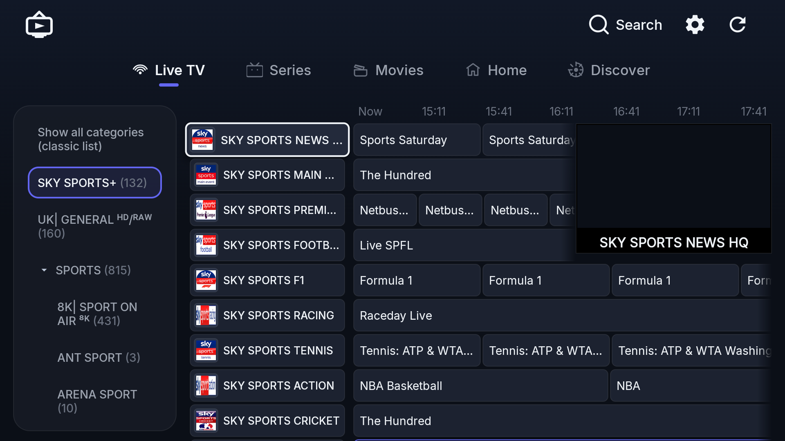
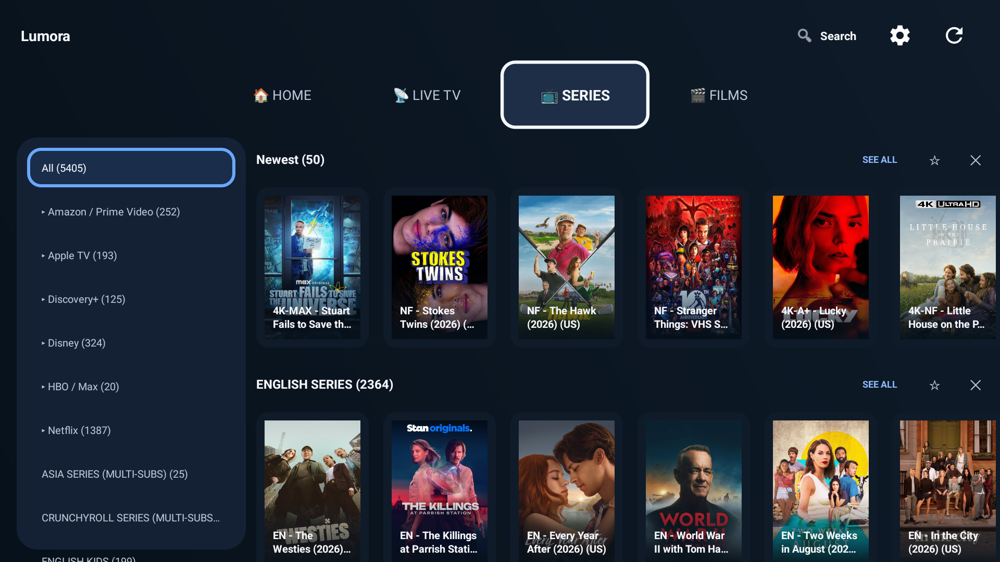
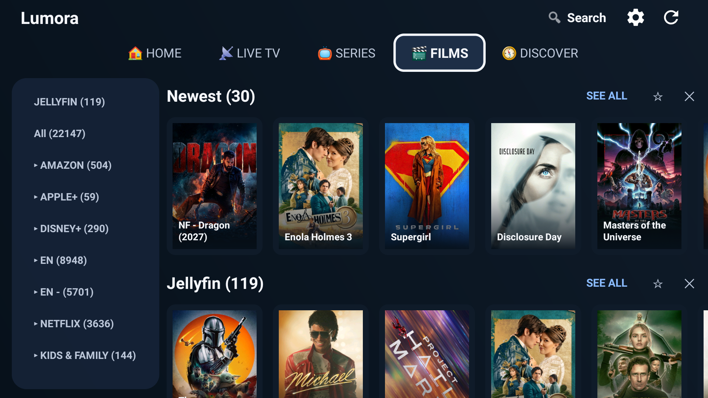
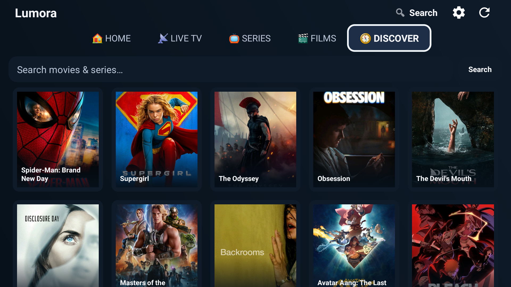
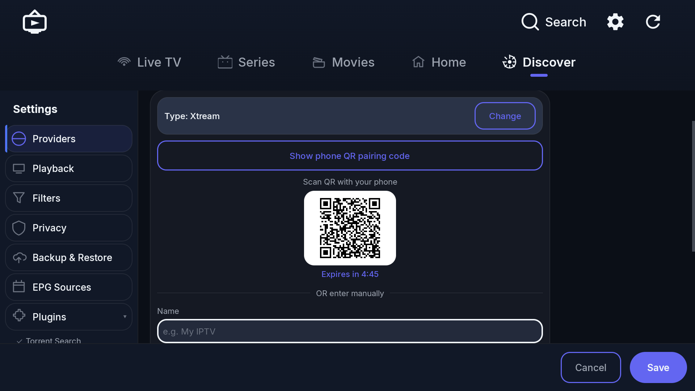
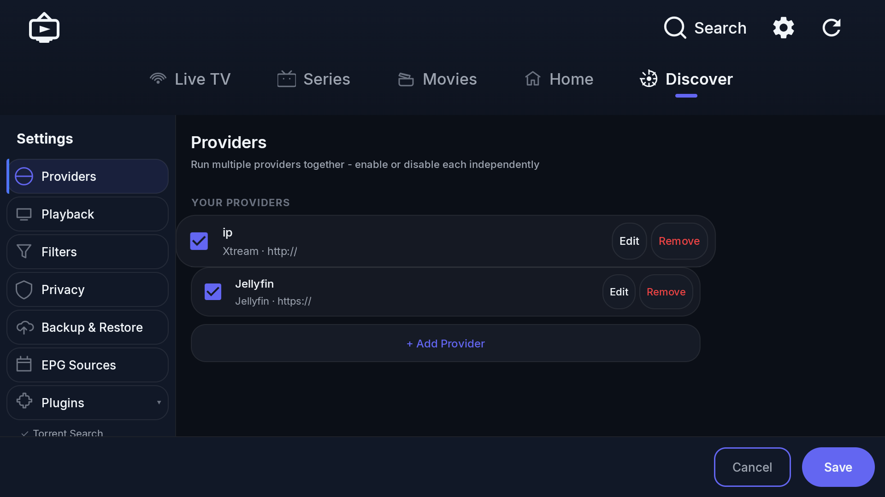
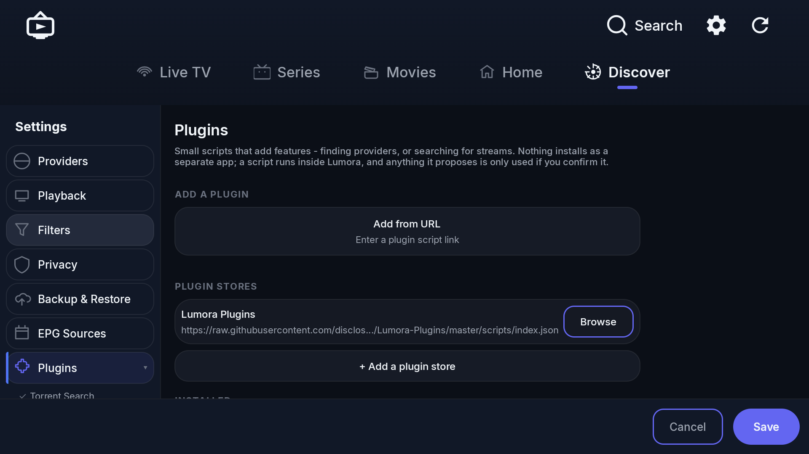

# Lumora

**Lumora** is a fast, lightweight IPTV and personal-media client for Android, Android TV, Fire TV, and — unusually — **Android Auto, where the full app runs on the car screen while parked**. It speaks **Xtream Codes, M3U/M3U8 playlists, Stalker Portal, Jellyfin, and Plex** — any number of them running at the same time — and merges Live TV, Movies, and Series from all of them into one clean, D-pad-friendly interface.

It's a native XML/Views app with **no Jetpack Compose anywhere**, and that's deliberate: on the budget TV boxes and streaming sticks these apps actually run on, heavier UI frameworks pin the CPU and cost you frames mid-playback. Everything here is built to stay smooth on hardware that has nothing to spare.

Nothing is behind a paywall — the multi-playlist support, EPG guide, recording, and catch-up that comparable players charge for are simply included.

> **Lumora is a player, not a provider.** It doesn't include, sell, host, index, or supply any channels, streams, or subscriptions of any kind. You bring your own IPTV service (Xtream Codes / M3U / Stalker Portal) or your own Jellyfin/Plex server, and Lumora plays it back. See [Disclaimer](#disclaimer).

## Highlights

- **Multiple playlists, EPG, DVR, catch-up and favourites — included, not unlocked.** The features comparable players reserve for a premium tier are all present, free, with no account and no telemetry.
- **The whole app on the car screen, over Android Auto — parked only.** Lumora appears in the Android Auto launcher and Android Auto projects the real interface onto the head unit, so you browse and play exactly as you do on the phone. It is **not a driving feature and cannot be one**: this class of app is restricted to a stationary vehicle, and a warning to that effect opens every launch on the car screen. See [Android Auto](#android-auto-parked-only).
- **Jellyfin and Plex, properly done.** Point Lumora at your own servers and their films and series merge into the same shelves as your IPTV catalogue — the same title from several sources becomes one card. Resume points, watched marks and favourites sync with the server, and files your stick can't decode are converted server-side rather than opening to a black screen.
- **Run every subscription at once.** Any number of Xtream Codes, M3U, Stalker Portal, Jellyfin and Plex sources active together, merged into one catalogue instead of switching between playlists.
- **Live TV that tidies itself up.** Duplicate feeds of the same channel collapse into one entry at the best available quality (4K → FHD → HD → SD), with instant fallback to any other copy mid-playback; Sports, News, Music and Cinema surface at the top automatically whatever your provider filed them under.
- **A proper EPG guide.** Scrollable program grid with per-channel schedules, now/next info, program reminders, timeshift/catch-up and DVR recording.
- **Full VOD browsing.** Movies and Series with category shelves, poster grids, season/episode browsing, episode-level Continue Watching and auto-advance to the next episode.
- **Discover, backed by TMDB.** Browse and search beyond what your providers carry; a title nobody in your libraries has offers **Find & Play**, which searches the sources you have enabled.
- **Offline downloads.** Save movies and episodes to the phone and watch them with no connection at all (phone only).
- **26 languages** plus English, with per-app language selection (Android 13+ system per-app language supported).
- **Built for the remote and for cheap hardware.** Native XML/Views, no Jetpack Compose — it stays smooth on the low-powered sticks these apps usually stutter on, and everything is reachable with a D-pad.

## Screenshots

| Live TV guide | Series library |
|---|---|
|  |  |

| Films library | Discover |
|---|---|
|  |  |

| Provider setup | Multiple providers at once |
|---|---|
|  |  |

| Plugin store |
|---|
|  |

## Features

### Live TV
- **Xtream Codes, M3U/M3U8, and Stalker Portal** provider support, any number at once
- **Smart channel merging** — automatically collapses duplicate channel feeds (different quality tiers, source tags, or provider re-listings of the same channel) into a single entry, auto-selecting the best available quality (4K/UHD → FHD → HD → SD), with instant manual fallback to any other version mid-playback
- **Dynamic categories** — Sports, News, Music, and Cinema surface automatically at the top of the channel list, pulling in matching content regardless of which raw provider category it's filed under; everything else cascades below
- **Brand/franchise clustering** — channel families (e.g. all feeds of the same sports network) group into a single expandable category automatically
- **Live EPG guide** — scrollable program grid with per-channel schedules, "now playing" info, and program reminders
- **Picture-in-picture live preview** while browsing the channel list
- **Timeshift/catch-up** playback where the provider supports it
- **DVR recording** — schedule and manage recordings directly from the guide

### Movies & Series
- Full VOD library browsing with category shelves
- Duplicate/version merging for movies re-listed under multiple source tags
- Season/episode browser with **episode-level "Continue Watching"** — resumes the exact episode you left off on, and auto-advances to the next episode when one finishes
- Watch state follows the *episode*, not the copy: finishing something on one provider marks it on the others, and on your Jellyfin/Plex servers
- Poster grid view for browsing a full category, plus a global search with poster results
- Pin, hide, and "See All" controls on every category shelf

### Jellyfin and Plex (optional)

Lumora is an IPTV player first — a personal media server is an extra slot you can fill if you happen to run one, and everything below is inert if you don't. Any number of each can be configured and enabled at the same time.

- Films and series merge into the **same shelves and poster grids** as your IPTV catalogue, with their own shelves on Films and Series; a title several sources carry becomes one card with each source selectable
- **Two-way progress sync** — resume points and watched marks are read from and reported back to the server, so viewing in any other client is reflected here and vice versa
- Server-driven **Continue Watching** and **Next Up** rows on Home, deduped against local progress
- **Favourites sync** (Jellyfin; Plex has no per-item equivalent, so those stay local)
- **Format handling** — plays the original file untouched where the device can handle it, and asks the server to convert it on the fly where it can't (10-bit HEVC, TrueHD/DTS audio and similar), based on what the device actually reports it can decode
- External and server-extracted **subtitle tracks** loaded with their forced/default flags honoured
- **Chapter picker** and, on Jellyfin, **seek-preview thumbnails** (trickplay)
- Real season names (Specials included) and per-episode watched state from the server
- Jellyfin: password or **Quick Connect** sign-in. Plex: account sign-in via the 4-character code at plex.tv/link, or by scanning a QR of that page
- Plex has **no Live TV** — its live path is a tuner-session flow Lumora's URL-per-channel model can't express — so a Plex entry covers Movies and Series only

### Playback
- Built on **Media3 (ExoPlayer)** with HLS, DASH, and RTSP support
- Adjustable playback speed, sleep timer, aspect ratio and zoom control, audio/subtitle track selection, A/V offset
- Automatic quality/source failover on stream error or sustained buffering
- **Hand-off to an external player** (VLC, MX Player, mpv, Just Player) for formats this device has no decoder for — hardware without a Dolby licence has no AC3/E-AC3 decoder, and rather than adding tens of megabytes of bundled software decoders to the APK, Lumora offers the stream to a player you already have, carrying the playback position across
- Google Cast support

### Android Auto (parked only)

> **Do not watch video while driving.** Watching video while driving is unlawful in most jurisdictions and dangerous everywhere. This feature exists for a stationary car or a passenger display. You are responsible for how and where you use it.

Lumora appears in the Android Auto launcher — wireless or wired — and Android Auto projects the app itself onto the head unit, so the car screen shows the real interface rather than an audio-only media shell.

- **The whole app, not a cut-down list.** Android Auto classifies it as a parked-only, immersive app, so browsing, search, the guide and playback all work as they do on the phone
- **Parked use is enforced by the car, not by an honour system.** Android Auto restricts apps of this class while the vehicle is in motion, the same as it does every other sideloaded video app. Lumora does no speed detection of its own and **must not be treated as a safety control** — the host is what stops the picture
- **Every launch on the car screen opens on a disclaimer** stating the parked-only limit, with the full "as is", no-warranty, no-liability notice in *Settings → Playback Settings*
- **Sideload only.** A video app is outside Google Play's policy for cars, so this build is not distributed on Play. You must also enable **Unknown sources** in Android Auto's developer settings before Lumora appears in the car launcher at all

Lumora is not affiliated with, endorsed by, or certified by Google. Android, Android Auto, Android TV, Google Cast and Google Drive are trademarks of Google LLC.

### Extending it

- **Plugins** — a small JS plugin engine plus a plugin store, for provider types and stream sources Lumora doesn't speak natively
- **Find & Play** — for a title none of your configured libraries carry, one search across the sources you have enabled, played best-first without a picker. Site sources are preferred over torrents (they start in about a second); within torrents, quality ranks above seeders
- **Site sources are on by default and can be turned off entirely** in *Settings → Streaming sites*, individually or all at once. They are third-party websites Lumora neither operates nor endorses — see [Disclaimer](#disclaimer)

### Other
- QR-code pairing — configure a provider on your phone, scan to push it to the TV instantly
- Parental controls with PIN-gated adult content filtering
- Non-English content filtering
- Local backup/restore (JSON export/import) plus optional Google Drive backup
- Downloads manager for offline movie/episode playback (phone only)
- Custom EPG source support (XMLTV), re-downloaded on a schedule

## Tested devices

Verified on real hardware, not just an emulator:

- **Amazon Fire TV Stick** — multiple generations, from the 1st gen through to the current one (the oldest sticks are exactly the low-powered hardware the Views-only UI exists for)
- **Sony Bravia** Android TV
- **Samsung** Android phone, including in-car over Android Auto

Anything else on Android 7.1 (SDK 25) or newer should work; those are just the devices it's actually been exercised on.

## Tech Stack

- **Language:** Kotlin
- **UI:** Android Views/XML
- **Playback:** [AndroidX Media3](https://developer.android.com/media/media3) (ExoPlayer)
- **Persistence:** Room, WorkManager (background sync), SharedPreferences, a flat delimited-text catalogue cache
- **Networking:** OkHttp
- **Car:** AndroidX Car App Library
- **Min SDK:** 25 (Android 7.1) · **Target SDK:** 36

## Installation

Grab the latest signed APK from the [Releases](https://github.com/disclosurez/lumora/releases) page and sideload it. Lumora checks GitHub Releases on launch and will prompt you when a new version is available.

On a Fire TV, the **Downloader** app code is **6626802**.

To use it in the car, also switch on **Unknown sources** in Android Auto's developer settings (Android Auto → Settings → tap *Version* ten times → ⋮ → Developer settings → Unknown sources). Lumora is sideloaded, so the car launcher hides it until that's on.

On first launch, you'll be asked to add a provider — this is your own Xtream Codes / M3U / Stalker Portal IPTV subscription, or your own Jellyfin or Plex server. Lumora has no content of its own and cannot supply one for you.

Questions and help: [Discord](https://discord.gg/cNKYGhQWvq).

## Building from Source

```bash
git clone https://github.com/disclosurez/lumora.git
cd lumora
./gradlew :app:assembleDebug
```

The debug APK will be at `app/build/outputs/apk/debug/app-debug.apk`.

### Release builds

Release builds are signed using a keystore referenced by `keystore.properties` in the project root (not committed — see `.gitignore`). To build a release APK yourself, create your own keystore and a `keystore.properties` file:

```properties
storeFile=path/to/your.jks
storePassword=...
keyAlias=...
keyPassword=...
```

Then run:

```bash
./gradlew :app:assembleRelease
```

## Project Structure

```
app/src/main/java/com/lumora/
├── adapter/       RecyclerView adapters (channels, categories, shelves, episodes, ...)
├── anime/         Anime catalogue client
├── auto/          Android Auto car-app classes
├── cache/         Local caches (catalogue, favorites, playback position, watch history, ...)
├── data/          Providers, Room database, backup, sync workers, update checker
│   ├── local/     Room database, DAOs, entities
│   ├── remote/    Jellyfin / Plex / Stalker / TMDB network clients
│   ├── backup/    Local + Google Drive export/import
│   └── sync/      WorkManager EPG sync worker
├── download/      Offline download manager (phone only)
├── model/         Core data models (Channel, Provider, IptvProviderConfig, ...)
├── pairing/       QR provider-pairing flow
├── parser/        M3U / Xtream Codes parsing
├── player/        Playback stack (ExoPlayer wrapper, Cast, subtitles, media session)
│   └── playback/  Sleep timer, speed control, timeshift, catch-up, diagnostics
├── plugin/        JS plugin engine and plugin store
├── recording/     DVR scheduling and capture
├── reminder/      Program reminder scheduling
├── scraper/       Site-source stack behind Find & Play
├── torrent/       Torrent streaming engine and local HTTP server
└── util/          Shared helpers (content grouping/dedup, URL utils, ...)
```

## Contributing

Issues and pull requests are welcome. Please open an issue describing the change before submitting a large PR.

## Disclaimer

**Lumora provides no content, service, or subscription of its own.** It is a generic IPTV/media client, comparable to a web browser or a media player — it does not host, stream, index, sell, endorse, or have any affiliation with any channel, film, series, or IPTV service. Everything played through Lumora comes from a source *you* configure or enable: an Xtream Codes account, an M3U playlist, a Stalker Portal, your Jellyfin or Plex server, a plugin you install, or a third-party site source. The authors have no visibility into, and no control over, what any of those serve.

**Third-party sources.** Find & Play searches third-party websites and public torrent indexes that Lumora does not operate, host, control, or endorse, and whose results it cannot vet. These sources are enabled by default and can be disabled entirely, or one by one, in *Settings → Streaming sites*. Availability, accuracy and legality of anything they return is a matter between you, that source, and the rights holder.

**Your responsibility.** You are solely responsible for ensuring that your use of Lumora, of any provider you configure, and of anything you play, download or record through it complies with the law where you are and with the terms of any service you subscribe to. Copyright law applies to streamed and downloaded material regardless of the software used to play it. Do not use Lumora to access content you are not entitled to.

**Android Auto.** The car feature is for a parked vehicle or a passenger display only. Watching video while driving is unlawful in most jurisdictions and dangerous everywhere. Lumora performs no speed or motion detection of its own and is not a safety system; do not rely on it as one.

**No warranty.** Lumora is provided "as is", without warranty of any kind, express or implied. The authors accept no liability for any loss, damage, penalty, data loss, or service termination arising from its use. See [LICENSE](LICENSE).

**Trademarks.** Lumora is an independent project with no affiliation with, endorsement by, or certification from any of the following. Android, Android TV, Android Auto, Google Cast, Google Drive and Google Play are trademarks of Google LLC. Fire TV and Amazon are trademarks of Amazon.com, Inc. Jellyfin is a trademark of the Jellyfin project. Plex is a trademark of Plex, Inc. Xtream Codes and Stalker Portal are the marks of their respective owners. All other names are used descriptively and belong to their owners.

This product uses the TMDB API but is not endorsed or certified by TMDB.

## License

[MIT](LICENSE) © 2026 Lumora.
